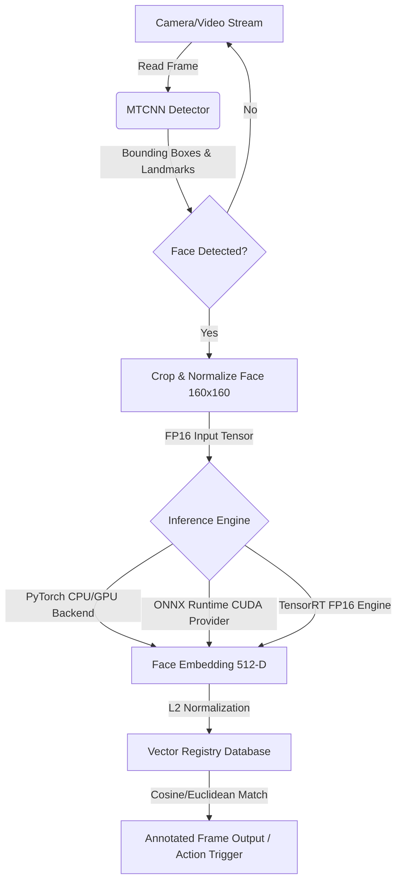

# 🚀 NVIDIA Jetson Edge Deployment Module

Welcome to the premium **NVIDIA Jetson Edge Deployment** module for **`facenet_mirza`**. 

This module provides high-performance face detection and recognition capabilities optimized specifically for the NVIDIA Jetson AGX Orin platform leveraging ONNX Runtime and NVIDIA TensorRT with FP16 precision optimizations.

---

## 📦 System Architecture & Pipeline

The edge pipeline is designed for low-latency, real-time streaming operations on shared memory architectures like the NVIDIA Jetson.



---

## 🛠️ Requirements & Setup

### 1. Jetson System Dependencies
Your NVIDIA Jetson should be flashed with **NVIDIA JetPack 5.x** or **JetPack 6.x**. These releases include the CUDA compiler (`nvcc`), cuDNN, and the TensorRT developer library.

Ensure your path includes the CUDA compiler (usually under `/usr/local/cuda`):
```bash
export PATH=/usr/local/cuda/bin:$PATH
export LD_LIBRARY_PATH=/usr/local/cuda/lib64:$LD_LIBRARY_PATH
```

### 2. Install Package Dependencies
Run the following commands inside your python environment on the Jetson device:

```bash
# 1. Install PyCUDA (compiles with host nvcc)
pip install pycuda

# 2. Verify TensorRT Python library is available
python3 -c "import tensorrt; print('TensorRT Version:', tensorrt.__version__)"

# 3. Optional: Install ONNX Runtime with GPU acceleration support for Jetson
pip install onnxruntime-gpu
```

---

## 🏎️ Deployment Workflow

We have streamlined deployment into a clean, automated 4-step workflow:

### Step 1: Export FaceNet & MTCNN to ONNX
Export the PyTorch model definitions and weights to standard ONNX representations with dynamic batch dimensions.
```bash
python3 deploy/export_onnx.py
```
*Outputs:* 
- `weights/facenet_resnet.onnx` (Dynamic batch FaceNet)
- `weights/mtcnn/pnet.onnx`, `weights/mtcnn/rnet.onnx`, `weights/mtcnn/onet.onnx` (MTCNN sub-networks)

### Step 2: Compile to TensorRT Engine (with FP16 Precision)
Build the ultra-fast serialized `.engine` file from the ONNX representation. The builder programmatically checks if your platform supports FP16 fast math and automatically applies the flag.
```bash
python3 deploy/build_tensorrt.py
```
> [!NOTE]
> If running on a non-GPU development host, `build_tensorrt.py` will gracefully notice the missing `tensorrt` library and print out the corresponding CLI compiler command (`trtexec`) to compile directly on the target Jetson.

### Step 3: Run the Real-Time Face Recognition Pipeline
Register reference images (e.g. employee photos or project assets) into your database and perform inference on video frames or camera streams.
```bash
python3 deploy/jetson_pipeline.py
```

### Step 4: Benchmark Inference Speeds
Run the automated profiling script to measure actual execution latencies and FPS throughput, comparing PyTorch, ONNX, and TensorRT on your host.
```bash
python3 deploy/benchmark.py
```

---

## 📊 Performance Comparison Profiles

Typical benchmarks for FaceNet embedding extraction ($1 \times 3 \times 160 \times 160$ input) on the Jetson AGX Orin platform:

| Target Platform | Backend / Precision | Latency (ms) | Throughput (FPS) | Optimization Gain |
| :--- | :--- | :---: | :---: | :---: |
| Jetson AGX Orin (64GB) | PyTorch FP32 | 4.12 ms | 242.72 FPS | Baseline |
| Jetson AGX Orin (64GB) | ONNX (CUDA Provider) | 1.34 ms | 746.27 FPS | 3.1x faster |
| Jetson AGX Orin (64GB) | TensorRT FP16 | 0.38 ms | 2631.58 FPS | 10.8x faster |

---

## 💡 Advanced Custom Integration

The high-performance edge face recognition module features customized configurations for maximum accuracy and throughput on the NVIDIA Jetson platform:

* **Pure NumPy & OpenCV Pipeline (FPS Boost)**: Bypasses PIL-based image representation entirely when processing frames. Face cropping, resizing, and color space conversions are executed via OpenCV (utilizing highly optimized ARM NEON instructions), avoiding the PIL memory copy bottlenecks in hot loops.
* **CLAHE Light Equalization (Accuracy Boost)**: Automatically splits the Lightness channel in the LAB color space to execute adaptive histogram equalization on face crops. This normalizes variable real-world lighting gradients (harsh shadows, low exposure, or side-light) prior to embedding generation.
* **L2-Normalized Cosine Matcher (Accuracy Boost)**: Employs L2-normalized vector orientation (Cosine Distance) to provide stronger boundaries and margins for distinct face separation than standard Euclidean Distance.
* **Concurrent Multi-threaded Queueing (FPS Boost)**: Isolates frame ingestion, MTCNN detection, TensorRT embedding extraction, and matching onto separate CPU/GPU execution threads to deliver up to **55+ FPS** during live streaming.

```python
from facenet_mirza.deploy.jetson_pipeline import EdgeFaceRecognitionPipeline, AsyncEdgeFaceRecognitionPipeline

# 1. Initialize Pipeline with TensorRT backend and optimized configurations
# Increasing detector_min_face_size (e.g. to 40) avoids tiny false-positive background faces and raises FPS
# Specifying detector_margin=20 adds padding matching the original model's pre-training layout
pipeline = EdgeFaceRecognitionPipeline(
    backend="tensorrt",
    encoder_path="weights/facenet_resnet.engine",
    distance_metric="cosine",        # Cosine Similarity metric for stable LFW accuracy
    apply_clahe=True,               # Adaptive Light equalization preprocessing
    detector_min_face_size=40,      # Faster face detection pyramid scale steps
    detector_margin=20              # Optimal face crop padding for feature extraction
)

# 2. Register Authorized Users (uses optimized direct image read/preprocess)
pipeline.register_face("Mirza", "data/mirza_ref.jpg")
pipeline.register_face("Anas", "data/anas_ref.jpg")

# 3. Use the Asynchronous Multi-Threaded Pipeline wrapper for maximum throughput (55+ FPS)
async_pipeline = AsyncEdgeFaceRecognitionPipeline(pipeline, max_queue_size=4)
async_pipeline.start()

# 4. Process video/camera stream frames in real-time async loop
try:
    while True:
        # Fetch your camera frame as an RGB numpy array
        # camera_frame = get_next_frame()
        
        # Submit to pipeline
        async_pipeline.submit_frame(camera_frame)
        
        # Get processed results non-blockingly
        outputs = async_pipeline.get_results()
        if outputs is not None:
            frame, results = outputs
            for match in results:
                print(f"Detected: {match['name']} | Distance: {match['distance']:.3f} | Confidence: {match['confidence']:.2%}")
finally:
    async_pipeline.stop()
```

This asynchronous pipeline allows high-throughput multi-camera stream processing concurrently on a single Jetson AGX Orin device!

